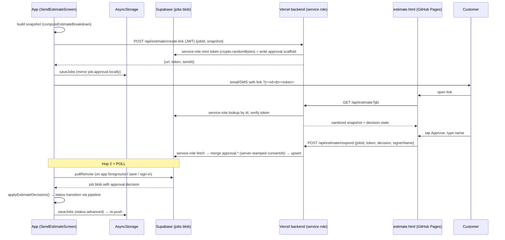

# Estimate-Approval Loop — Design Spec

- **Date:** 2026-07-17
- **Status:** Approved for planning (owner go-ahead 2026-07-17). No code until the implementation plan is separately approved.
- **Owner decisions locked:** typed-name e-signature in v1 (drawn deferred); a **real `declined` status** in the pipeline; **poll-only** device reconciliation (push deferred); **server-mint** approval token (revised from client-mint during planning — the app has no secure RNG and adding one is a dependency change; Node `crypto.randomBytes` in a JWT-authed `create-link` endpoint costs zero app dependencies and removes the "link 404s until sync" caveat).

## 1. Problem

`SendEstimateScreen` today generates an AI message, exports a PDF, composes an email/SMS, and `markAsSent()` sets `status:"estimate_sent"` — then stops. There is no way for the customer to signal acceptance, and no way for that acceptance to flow back into the job pipeline. The tradesperson has to chase the answer by phone and manually advance the job.

**Goal:** the customer receives a link, views the estimate on the existing GitHub Pages legal site, and taps **Approve** or **Decline**. The decision flows back, advances the job through the existing status pipeline (respecting `approved → scheduled` rules), and stamps an authoritative consent timestamp. A typed-name signature is captured on approval.

## 2. Non-goals (v1)

- Drawn / canvas signature (deferred — clean follow-on phase; pulls in a Supabase Storage bucket).
- Push notification to the tradesperson on approval (deferred — app has no remote-push pipeline today).
- Any change to the last-write-wins conflict model. We inherit the accepted envelope; we do **not** build merge/conflict detection.
- Business logo on the public page (logo photos are device-local and never sync — §10). v1 uses a text business-name header.

## 3. Precedent this is built on

The Stripe payment flow is the exact shape of this feature and is the template for every backend decision:

- `backend/api/stripe/webhook.js` receives a customer action → uses `SUPABASE_SERVICE_ROLE_KEY` to **fetch → merge → upsert** the invoice JSON blob (bypassing owner-scoped RLS) → the device's existing `pullRemote` picks it up on next focus/sync and the invoice auto-marks paid with **zero new client sync infrastructure**.
- `backend/api/create-payment-link.js` is the template for backend security hygiene: IP rate-limiter, CORS allow-list, service-role Supabase reads.

An estimate-approval loop is the same pattern applied to a `Job` blob instead of an `Invoice` blob. The reconciliation path (`pullRemote`) is already blessed by the architecture (`tradeready-architecture-contract` §1: "cloud writes are eventually consistent … that latency is by design").

## 4. Architecture overview

Four surfaces, one new data object.



### 4.1 Data model (`types/models.ts`)

Additive optional field on `Job` — a JSON-blob change, so **no backend schema migration** (`tradeready-storage-and-sync` §7).

```ts
export interface EstimateApproval {
  token: string;               // high-entropy capability, minted server-side (Node crypto.randomBytes) by the create-link endpoint
  sentAt: string;              // ISO — when the approval link was generated
  // Frozen snapshot of the estimate as sent — so the backend never re-runs pricing
  // math and the customer approves exactly what they saw.
  snapshot: {
    businessName: string;
    customerName: string;
    jobTitle: string;
    lineItems: { label: string; amount: number }[]; // labor / materials / overhead
    total: number;
    currency: string;
  };
  decision?: "approved" | "declined";
  consentAt?: string;          // ISO — stamped SERVER-SIDE at the decision moment (authoritative clock)
  signerName?: string;         // typed name (v1 e-signature)
  declineReason?: string;
  ip?: string;                 // server-captured — consent paper trail
  userAgent?: string;          // server-captured
  // v-next: signatureRef?: string;  // Supabase Storage key for a drawn signature
}

// on Job:
approval?: EstimateApproval;
```

Absence of `approval` = the job was never sent for approval. Legacy jobs simply lack it.

### 4.2 Pipeline change — the `declined` status (§4/§5 owner-gated)

The 8-status pipeline (`lead → estimate_sent → approved → scheduled → in_progress → complete → invoiced → paid`) has no "declined." The owner approved adding a real one. `declined` is a **branch off `estimate_sent`, not a forward step**.

Changes (tsc `Record<JobStatus, …>` exhaustiveness enforces we hit them all — that compiler pressure is the point, §5):

1. `types/models.ts` — add `"declined"` to the `JobStatus` union.
2. `utils/pricingEngine.ts` `JOB_STATUSES` — add
   `declined: { label: "Declined", color: "danger", next: null }`.
   - `color: "danger"` — **`BadgeColor` already includes `"danger"`** (`components/UI.tsx:13`); no new semantic token needed.
   - `next: null` — declined is terminal for the linear "advance" action (like `paid`). Re-sending a revised estimate is a separate explicit reset (Phase 5), not a `.next` walk.
3. `utils/jobStatusDisplay.ts` `JOB_STATUS_DISPLAY` — add a `declined` entry pointing at a new `theme.statusDeclined`.
4. `utils/theme.ts` — add `statusDeclined` to **both** light and dark palettes (e.g. light `#EF4444`, dark `#f87171`). (Reminder, §4 nuance: `jobStatusDisplay.ts` imports the static `colors` alias, so Today's badge uses the light hex even in dark mode — matches every other status; do not "fix" that here.)
5. **Audit consumers:** any status-ordering array (pipeline/filter views) — `declined` is a branch, not part of the forward order; decide placement (likely a filter chip, not inline in the linear pipeline). tsc surfaces exhaustive switches.

### 4.3 Transition logic (`utils/jobStatus.ts`)

A pure function beside `advanceStatusForSchedule`, mirroring its no-regress guarantee:

```ts
export function applyEstimateDecision(
  status: JobStatus,
  decision: "approved" | "declined",
): JobStatus {
  // Only act before the tradesperson has taken the job forward — never regress
  // a job already at scheduled…paid (mirrors advanceStatusForSchedule).
  if (status !== "lead" && status !== "estimate_sent") return status;
  if (decision === "approved") return JOB_STATUSES.estimate_sent.next ?? status; // → "approved" (from the pipeline, not a hardcoded string)
  return "declined"; // the one off-`.next` branch — centralized + unit-tested here, exactly once
}
```

Approved derives from `JOB_STATUSES.estimate_sent.next`, honoring §5. `declined` is the single sanctioned off-`.next` assignment, confined to this pipeline-owning module (no screen ever hardcodes it).

### 4.4 Device reconciler (`utils/storage/estimateApprovals.ts`)

Idempotent, flag-free, modeled on `migrateCustomerIdentity` (pure list-transform core + async wrapper; test pattern per `__tests__/customerIdentity.test.js`):

```ts
// pure core (unit-tested)
export function applyDecisionsToJobs(jobs: Job[]): { jobs: Job[]; changed: boolean };

// async wrapper
export async function applyEstimateDecisions(): Promise<void> {
  // loadJobs → applyDecisionsToJobs → saveJobs ONLY if changed
  //   (saving enqueues a full re-upload — a no-op run must not write, §4)
}
```

For each job with `approval.decision` set, compute `applyEstimateDecision(job.status, decision)`; if it changes, update `job.status`. **Idempotent:** once advanced, the status is no longer `lead`/`estimate_sent` so the function returns unchanged → no write. **No permanent "already ran" flag** — sync can pull an un-applied decision from the cloud at any time (second device, reinstall), so it must be cheap to run repeatedly and converge (`tradeready-storage-and-sync` §7).

**Wiring:**
- `App.tsx` RootNavigator session `useEffect`, beside `migrateCustomerIdentity`: `applyEstimateDecisions().catch(() => {})`.
- After `pullRemote` in the foreground/sync path (`context/AuthContext.tsx` AppState handler) so a decision pulled on foreground is applied the same cycle.

## 5. Write-back path — poll, not webhook

Two hops; only the second is a webhook-vs-poll choice.

- **Hop 1 (customer → cloud):** a **direct** token-authenticated `POST` from the customer's browser to our Vercel endpoint, which writes to Supabase via service role. Immediate and authoritative. This is *not* a third-party webhook (in the Stripe case, Stripe calls us; here the customer calls us directly), so there is nothing to poll on this hop.
- **Hop 2 (cloud → tradesperson's device):** **poll**, via the existing `pullRemote` on app-foreground / save / sign-in — the exact mechanism the Stripe invoice-paid flow already relies on. **Zero new client sync infrastructure.** Latency = "next time you open the app," acceptable for an approval. Push-to-device is the deferred enhancement.

### 5.1 Reconciliation with local-first (the crux)

- **Server writes are additive and confined to `job.approval.*`.** The server **never** touches `job.status` — the device owns every pipeline transition (§5). This keeps the clobber surface tiny.
- **`consentAt` is stamped server-side** (authoritative clock) → a durable legal timestamp independent of device state.
- **Device performs the transition** via `applyEstimateDecisions()` → `applyEstimateDecision()` (§4.3–4.4), through the pipeline.
- **Respects `approved → scheduled`:** the loop stops at `approved`. The existing `advanceStatusForSchedule` still owns the `approved → scheduled` hop when a `scheduledDate` is added. The loop never sets `scheduled` and never regresses a job past `estimate_sent`.
- **Inherited hazard, stated plainly:** `pullRemote` is whole-record, remote-wins per id (`tradeready-storage-and-sync` §5). If the device holds an **un-pushed queued edit** to the *same* job when the server writes the approval, the device's later push of its stale blob can clobber `approval.*` (last-write-wins). This is the **same accepted envelope** as the Stripe case (customer pays while the tradesperson edits the invoice offline) — §8/§10. It shrinks but does not vanish because: (a) server writes are additive, so a device that pulled-before-pushing preserves them; (b) the reconciler re-saves the derived status, re-enqueuing and re-pushing to re-converge; (c) the consent fact is durable server-side regardless. We do **not** add a merge system — that would violate the accepted LWW design and is separate owner-scoped work.

## 6. Security model

- **Token = bearer capability.** The link carries `?j=<jobId>&t=<token>`. Anyone with the link can view/act — exactly like a Stripe payment link (anyone with that link can pay). The consent record (server timestamp + typed name + IP/UA) is the paper trail. Acceptable.
- **Indexed lookup + constant-time compare.** Backend fetches the job by primary-key `id` (indexed), then constant-time-compares the stored `approval.token`. No/invalid token → `404`. Exposing the job id is low-risk because the token is the actual capability and the backend enforces the match.
- **No new Supabase table → no new RLS surface.** The approval data rides inside the existing owner-scoped `jobs` table; the service role mediates all public access, so no public RLS grant is introduced (§8). RLS never sees the anonymous viewer.
- **Sanitized GET payload:** only this estimate's snapshot + decision state. No other customer PII, no other jobs, nothing beyond the frozen snapshot.
- **Rate-limited** per IP (reuse the `create-payment-link.js` sliding-window limiter). **CORS** allow-list: `https://czilla57.github.io`.
- **No CAPTCHA** (out of policy, and unnecessary — a bot "approving" merely advances a job the tradesperson initiated; low harm).

## 7. Backend endpoints (`backend/api/estimate/`)

All three reuse the webhook's `fetch → merge → upsert` service-role helper (factored into `backend/lib/estimateStore.js`) and the `create-payment-link` rate-limiter/CORS scaffolding. To avoid Vercel file-vs-folder routing ambiguity the read endpoint is `/api/estimate/view` (not `/api/estimate`).

### `POST /api/estimate/create-link` (JWT-authed — server-mint)
1. Verify Supabase JWT → `userId`; rate-limit per user (mirrors `create-payment-link.js`).
2. `fetchJobForUser(jobId, userId)`; if the job hasn't synced to the cloud yet → `422` ("Open the app while online and try again").
3. Reuse an existing `approval.token` if present (re-send keeps an outstanding link valid), else mint `crypto.randomBytes(24).toString('hex')`.
4. Merge `approval ← { token, sentAt, snapshot }` (never touching `decision`/`consentAt`); upsert.
5. Return `{ url, token, sentAt }`. The app mirrors this into the local job blob so `JobDetail` reflects it immediately.

### `GET /api/estimate/view?j=<jobId>&t=<token>`
1. Rate-limit by IP; CORS.
2. Service-role fetch `jobs?id=eq.<jobId>&select=user_id,data`.
3. Not found, or `data.approval.token` mismatch (constant-time) → `404`.
4. Return sanitized: `{ ...data.approval.snapshot, decision, consentAt, signerName, signatureRequired: true }`.

### `POST /api/estimate/respond`
Body `{ jobId, token, decision: "approved"|"declined", signerName, declineReason? }`.
1. Rate-limit; CORS; validate body (`signerName` required when `decision==="approved"`).
2. Service-role fetch job; verify token (constant-time) → else `404`.
3. **State machine:** `undecided → approved` (terminal, locked); `undecided → declined → (re-)approved` allowed; once `approved`, further changes ignored (return current state).
4. Merge `approval` ← `{ decision, consentAt: <server now ISO>, signerName, declineReason, ip, userAgent }`; upsert with `updated_at = now`, `deleted: false`, preserving `user_id` and all other blob fields.
5. Return `{ ok: true, decision, consentAt }`.

Env vars (already present for the Stripe path): `SUPABASE_URL`, `SUPABASE_SERVICE_ROLE_KEY`.

## 8. Public viewer (`tradeready-legal/estimate.html`)

Static HTML/CSS/vanilla JS, matching the existing legal pages (`.nojekyll`, no build step; visual language of `privacy.html`/`confirmed.html`).

- Parse `?j` & `?t`; `GET` the estimate from `https://backend-tradeready1.vercel.app/api/estimate/view`.
- Render: business-name header (text, no logo in v1), customer name, job title, line-item breakdown, total.
- **Approve:** requires a typed name (v1 e-signature); `POST` `/respond`; show confirmation (reuse `confirmed.html` styling).
- **Decline:** optional reason; `POST`; show acknowledgment.
- **Already-decided state:** "You approved this estimate on <date>" (from the GET payload) — no re-submit.
- Error states: unknown/expired link, network failure.

## 9. App send flow (Phase 5)

- `SendEstimateScreen`: add a **"Send for approval"** affordance that
  1. computes the snapshot via the real `computeEstimateBreakdown` + settings/customer,
  2. sets `status:"estimate_sent"` and `saveJobs()` so the job exists in the cloud, then `POST`s `{ jobId, snapshot }` to `/api/estimate/create-link` (JWT) — the backend mints the token and returns `{ url, token, sentAt }`,
  3. mirrors `job.approval = { token, sentAt, snapshot }` into the local blob (so `JobDetail` updates immediately) via `saveJobs()`,
  4. offers Copy / Email / SMS (reuse `composeEmail`/`composeSMS`) with the returned `url` embedded.
- Extend `generateEstimateMessage` (`utils/invoiceHelpers.ts`) with an optional `approvalLink` so the AI message includes a clear call-to-action to view & approve.
- `JobDetail`: surface approval state — "Sent for approval" / "Approved <date> by <name>" / "Declined <date>" (the new `declined` badge) — and a **"Re-send / revise"** action that resets a `declined` job to `estimate_sent` (explicit; not a `.next` walk).

## 10. Phase-gated plan

Each phase ends at a **green gate** (`npm run typecheck` + `npm test` + `npm run lint` from `tradeready\`) and **stops for owner go-ahead** before the next (`tradeready-change-control`). No commit on a red gate.

| Phase | Scope | Gate artifacts |
|---|---|---|
| **1 — Pipeline + data model** | `declined` in `JobStatus` / `JOB_STATUSES` / `JOB_STATUS_DISPLAY`; `statusDeclined` theme hex (light+dark); `EstimateApproval` + `Job.approval` types; `applyEstimateDecision()`; resolve tsc exhaustiveness fallout; audit status-ordering consumers. | Pure-logic tests for `applyEstimateDecision` (approve/decline/no-regress). §4/§5 owner-gated. |
| **2 — Device reconciler** | `applyDecisionsToJobs` core + `applyEstimateDecisions` wrapper; wiring (session `useEffect` + post-pull). | Tests: idempotence (run twice = no 2nd write), approved, declined, no-regress. No network. |
| **3 — Backend endpoints** | `GET /api/estimate`, `POST /api/estimate/respond`; service-role, token verify, rate-limit, CORS, sanitized payload, server-stamped `consentAt`, state machine. | Deploy to Vercel; verify against a seeded job (200 authed-by-token, 404 bad token, idempotent re-POST). |
| **4 — Public viewer** | `estimate.html` on tradeready-legal: fetch, render, approve/decline, typed name, confirmation, already-decided, error states. | Manual end-to-end against deployed endpoints (approve + decline paths). |
| **5 — App send flow** | `SendEstimateScreen` "Send for approval" (mint → link → message); `generateEstimateMessage` `approvalLink`; `JobDetail` approval surface + declined re-send reset. | Tests for link/snapshot construction; gate green. |
| **6 — E2E + docs** | Full loop on an EAS build/device; update README sync-model + known-limitations (new server-write path), ARCHITECTURE, `terms.html`/`privacy.html` (consent + e-sign language). | Manual E2E; docs reviewed. |
| **Deferred (post-v1)** | Drawn signature (+ Supabase Storage bucket, public-read policy, `signatureRef`); push-on-approval (remote-push infra). | — |

## 11. Testing strategy

- **Pure logic (Jest):** `applyEstimateDecision` (all branches, no-regress); `applyDecisionsToJobs` (idempotence, mixed collections); snapshot/link construction. Follow the pure-core + async-wrapper split (`__tests__/customerIdentity.test.js` pattern).
- **Backend:** manual/curl verification against a seeded Supabase job — token match/mismatch, state machine, idempotent re-POST, rate-limit.
- **E2E (Phase 6):** real device/build — send, open link, approve, confirm the job advances to `approved` after foreground sync; decline path; approved→scheduled still fires on adding a date.

## 12. Open details to settle in the implementation plan

- Exact `statusDeclined` hex values (proposal: light `#EF4444`, dark `#f87171`).
- Where `declined` appears in job-list filters (branch chip vs. inline) — decided during the Phase 1 consumer audit.
- Reconciler wiring point in `AuthContext` foreground path (confirm the precise call site alongside the existing pull trigger).

## 13. Risks & inherited limitations

- **Last-write-wins clobber window** (§5.1) — accepted, same envelope as Stripe invoice-paid.
- **Link generation needs connectivity** — `create-link` requires the job to already be in the cloud, so the app saves + syncs before calling and the endpoint returns `422` ("sync first") otherwise. This is the cost of server-mint; in exchange the token is server-side *before* the link is shared, so there is no "404 until sync" window on the customer's side.
- **JSON-field query cost** — mitigated by looking up by indexed primary-key `id` and verifying the token in the blob (no full JSON scan).
- **No logo on the public page** in v1 (device-local photos, §10).
